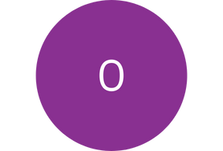

        

            
            <a href="{{ site.baseurl }}{{ first_post.url }}"><b> OPENING SESSION </b> </a>
        

        
        
        

        

            
            <!--  -->
            

                <a href="{{ site.baseurl }}{{ first_post.url }}">
                    
                    
<b>{{agenda.title}} </b>  
</a>
                <ul class="square">
                    
                        
                            
                         
                            
                                <a href="{{ site.baseurl }}{{ post.url }}">
                                    <li>{{sub_module}} </li>
                                </a>
                        <!--  -->
                    
                </ul>
            

        

        

        

            
            <a href="{{ site.baseurl }}{{ first_post.url }}"><b> CLOSING SESSION </b> </a>
        

